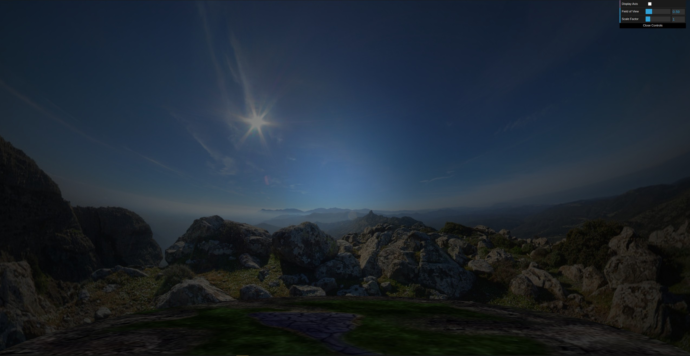
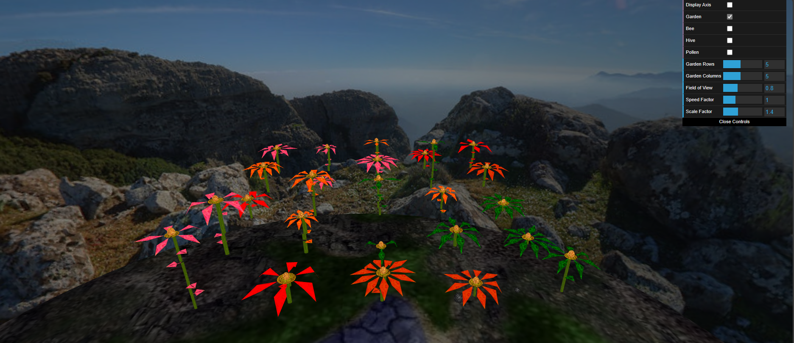
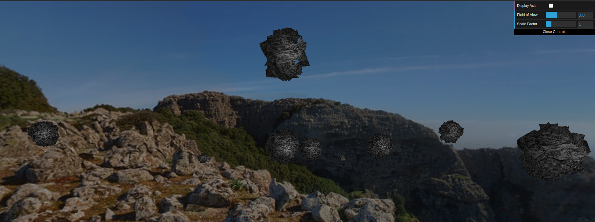
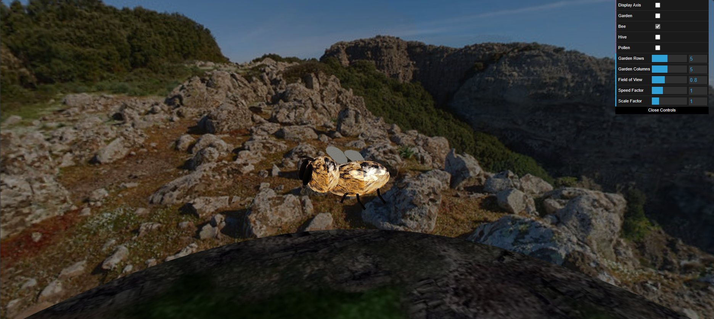
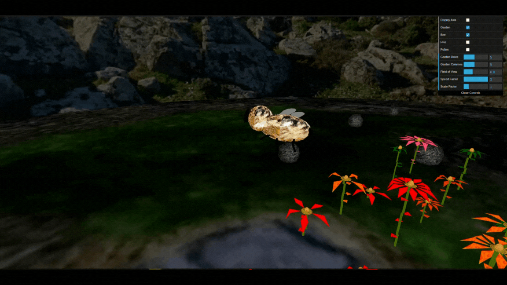

# Computação Gráfica 2023/2024

## Group T02G11

- Eduardo Oliveira - 202108690
- João Coelho - 202004846

## Project

### 1. Sky-Sphere (Captura de ecrã 1)

### 2. Flores (Captura de ecrã 2)

### 3. Pedras e penedos (Captura de ecrã 3)

### 4. Abelha

#### 4.1 Modelação da abelha (Captura de ecrã 4)

#### 4.2 Animação da abelha (Captura de ecrã 5)

### 5. Pólen e colmeia (Captura de ecrã 6)

### 6. Shaders e animação (Captura de ecrã 7)

### Features não implementadas:
- Desenvolvimentos adicionais

