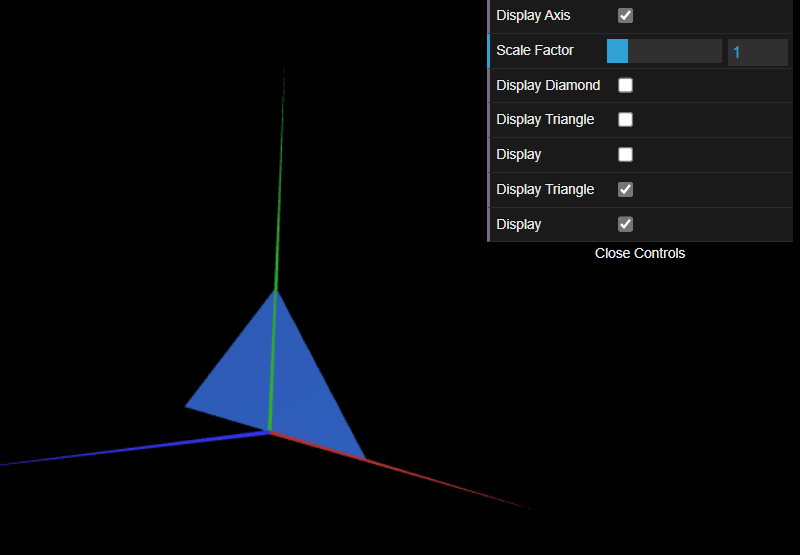
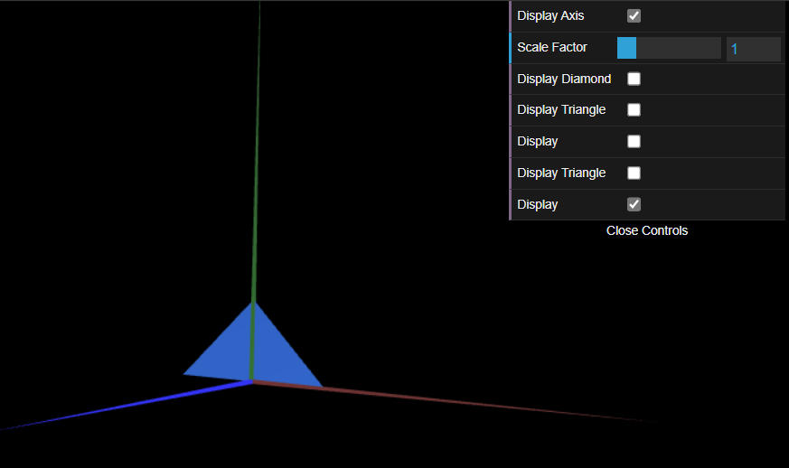

# CG 2023/2024

## Group T02G11

## TP 1 Notes

- In exercise 1 we observed that we can define the parallelogram with only 4 vertices, instead of 6.
- In exercise 2, the triangles follow the same logic, so the code was able to reused for both.

