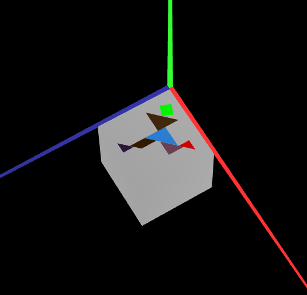
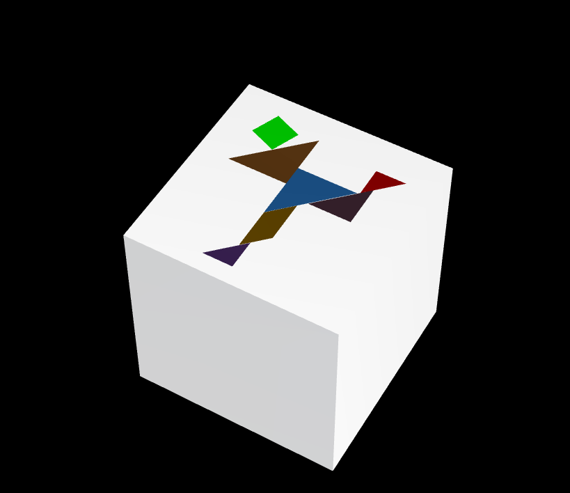

# CG 2023/2024

## Group T02G11

## TP 2 Notes

- In the first exercise, we applied theoretical knowledge of geometric transformations (translations, rotations, scaling) in constructing a tangram. It was a challenging task to make the tangram resemble the original.
- In the second exercise, we utilized the knowledge from tp1 to construct a unit cube, defining the 8 vertices and indices appropriately. Additionally, we placed the tangram on one of the faces of the cube as requested. 
- In the third exercise, we implemented a cube defined by planes. This implementation made it easier to see the definition of the cube's vertices and edges.

