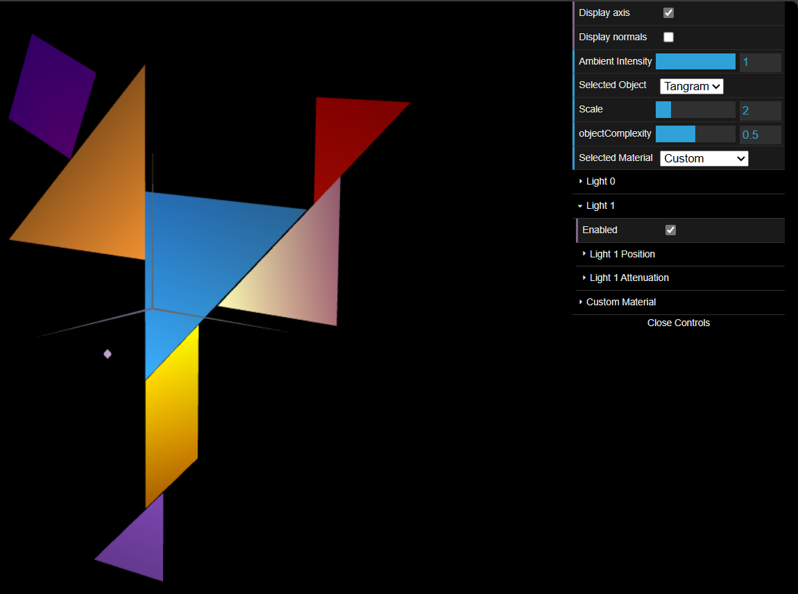

# CG 2023/2024

## Group T02G11

## TP3 Notes

- In Exercise 1, one of the most challenging parts was creating the normals on the cube and the tangram. The part of creating the various materials wasn't difficult, but it was laborious.

- In Exercise 2, the most challenging part was to design how each slice would be drawn, as well as the normals of each vertex. For that, we used as a reference the example of the unit cube from this tp. The part of enabling multiple stacks in the exercise was simpler.

- In Exercise 3, we had to figure out how to simplify the vertices and normals, by referring the same vertex more than once in the index list. After doing that, the file became cleaner and implementation became lighter.

