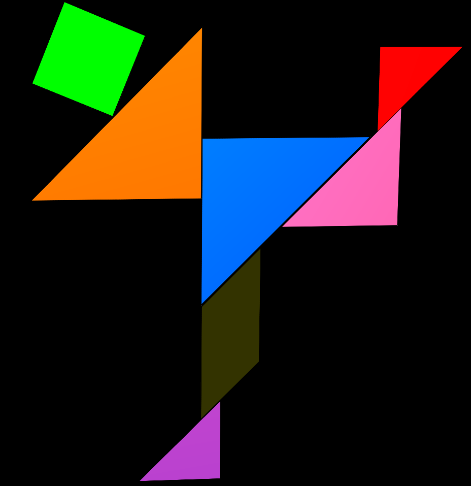
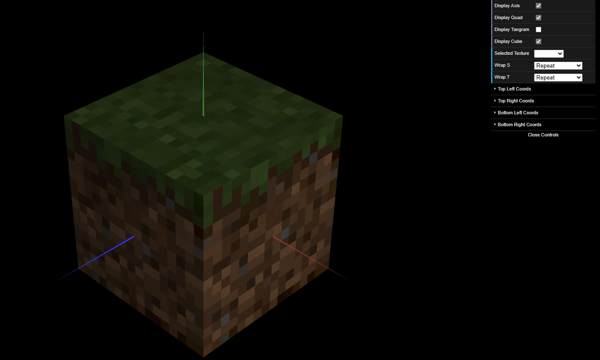

# CG 2023/2024

## Group T02G11

## TP4 Notes

- In Exercise 1, one of the most challenging parts was understanding how to define different texture coordinates for objects of the same type, like the 2 instances of TriangleBig. After figuring out how to do it, the rest of the exercise was relatively easy, as the process is similar for all objects.

- In exercise 2, we managed to complete the challenge with relative ease. I would say the most challenging part was finding the line of code that allowed us to enhance the cube's texture.

