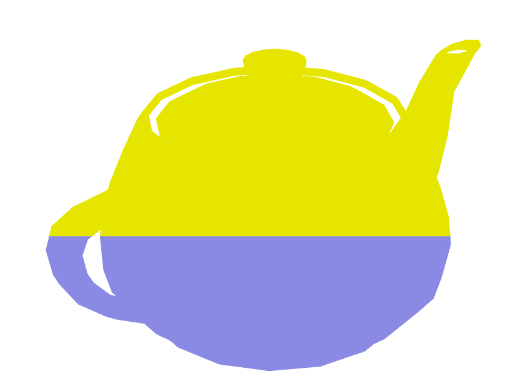
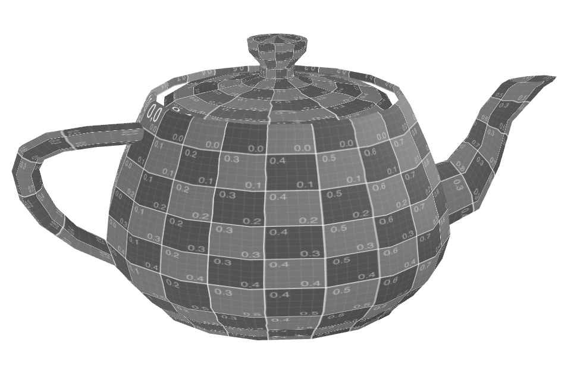
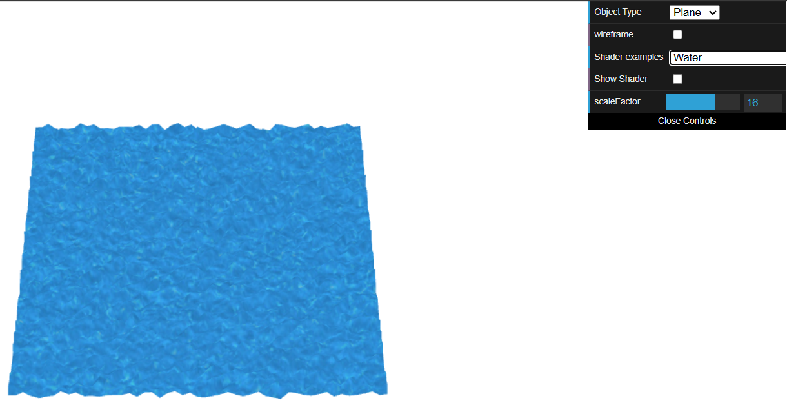

# CG 2023/2024

## Group T02G11

## TP5 Notes

- In Exercise 1, we had to figure out the differences between fragment and vertex shaders. After looking into them, producing the code itself wasn't very hard.

- In exercise 2, the part that was the most challenging was modifying both shaders created to achieve an effect similar to the one in the image provided in the script.

